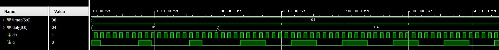

# About
This repository will contain the verilog codes, output files and other relavant files used the online internship on VLSI circuit design, organised by SCL Chandigarh and EICT Academy, IIT Guwahati.
## Workshop assignment Problems
### 1.  Design a simple pulse-width modulation PWM signal generator, where user can control the width of the pulse.

** To view the verilog code click [**here**](https://github.com/ankursah5/SCL-EICT-Internship/tree/main/Verilog%20files/PWM)
### Output Simulation

  

### 2. Design 4-bit binary synchronous counter
** To view the verilog code click [**here**](https://github.com/ankursah5/SCL-EICT-Internship/tree/main/Verilog%20files/Counter)

### Output Simulation

  

### 3. Create a FIFO buffer system which can store 5 numbers of 4bit each.
** To view the verilog code click [**here**](https://github.com/ankursah5/SCL-EICT-Internship/tree/main/Verilog%20files/FIFO)

### Output Simulation

  

### 4. Suppose you have a 1-bit serial binary data stream synchronized with system clock. **Now design a circuit that will count the number of times a user defined 4-bit sequence is occurred in the entire data stream.** For simplicity you can defined the sequence while designing. (Hint: FSM method will reduce the complexity of design; nested FSM may be used.)

#### Method 1 using Shift Register

** To view the verilog code click [**here**](https://github.com/ankursah5/SCL-EICT-Internship/tree/main/Verilog%20files/SequenceD)

### Output Simulation

  

#### 5.	Design a 3x3 Matrix Multiplier

** To view the verilog code click [**here**](https://github.com/ankursah5/SCL-EICT-Internship/tree/main/Verilog%20files/Matrix)

### Output Simulation

aa[0][0] = 1 aa[0][1] = 2 aa[0][2] = 3
aa[1][0] = 1 aa[1][1] = 2 aa[1][2] = 3
aa[2][0] = 1 aa[2][1] = 2 aa[2][2] = 3

bb[0][0] = 1 bb[0][1] = 2 bb[0][2] = 3
bb[1][0] = 1 bb[1][1] = 2 bb[1][2] = 3
bb[2][0] = 1 bb[2][1] = 2 bb[2][2] = 3

cc[0][0] = 6 cc[0][1] = 12 cc[0][2] = 18
cc[1][0] = 6 cc[1][1] = 12 cc[1][2] = 18 
cc[2][0] = 6 cc[2][1] = 12 cc[2][2] = 18

